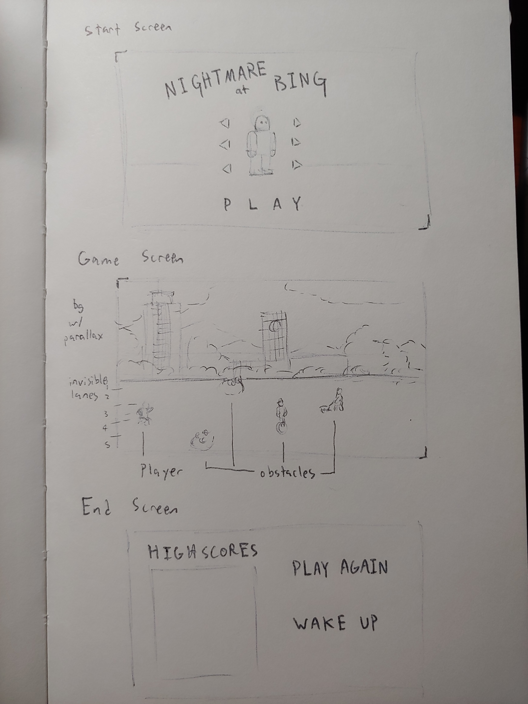

:warning: Everything between << >> needs to be replaced (remove << >> after replacing)

# Runner Type Game
## CS 110 Final Project
### Fall Semester, 2019
### [Assignment Description](https://drive.google.com/open?id=1HLIk-539N9KiAAG1224NWpFyEl4RsPVBwtBZ9KbjicE)

<< [https://github.com/bucs110/final-project-fall19-magic-methods](#) >>

<< [link to demo presentation slides](#) >>

### Team: Magic Methods
#### Ethan Huang, Anthony Tom, Jiahao Pan

***

## Project Description
Our project is a runner type game based loosely on the mechanics of Kiloo's Subway Surfers and Halfbrick Studio's 
Jetpack Joyride. The game centers around a nightmare in which the player is running to class, but never gets there.
As the player runs to class, various obstacles and powerups (TBD) will appear. The game's design will be based on the
school's campus itself.

***    

## User Interface Design
* 
    * For example, if your program has a start screen, game screen, and game over screen, you should include a wireframe / screenshot / drawing of each one and a short description of the components
* << You should also have a screenshot of each screen for your final GUI >>

***        

## Program Design
* Non-Standard libraries
    * << You should have a list of any additional libraries or modules used (pygame, request) beyond non-standard python. >>
    * For each additional module you should include
        * url for the module documentation
        * a short description of the module
* Class Interface Design
    * << A simple drawing that shows the class relationships in your code (see below for an example). >>
        * 
    * This does not need to be overly detailed, but should show how your code fits into the Model/View/Controller paradigm.
* Classes
    * << You should have a list of each of your classes with a description. >>

***

## Tasks and Responsibilities
* You must outline the team member roles and who was responsible for each class/method, both individual and collaborative.

### Software Lead - Ethan Huang

The Software Lead will be overseeing the code written by both the Front End Specialist and the Back End Specialist
and making sure that the team has a schedule for features that need to be implemented. He will also be responsible 
for ensuring that the logic written by Back End Specialist is correct.

### Front End Specialist - Jiahao Pan

The Front End Specialist will be writing the code that depicts the game's assets and designs on the screen. 

### Back End Specialist - Anthony

The Back End Specialist will be writing the necessary classes and drawing diagrams showing the relationships between
each of the classes. He will also be responsible for writing the code that performs the game's mechanics.

## Testing
* << Describe your testing strategy for your project. >>
    * << Example >>

* Your ATP

| Step                  | Procedure     | Expected Results  | Actual Results |
| ----------------------|:-------------:| -----------------:| -------------- |
|  1  | Run Counter Program  | GUI window appears with count = 0  |          |
|  2  | click count button  | display changes to count = 1 |                 |
etc...
